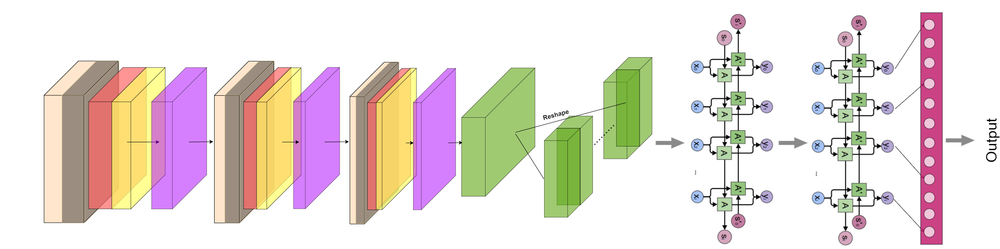
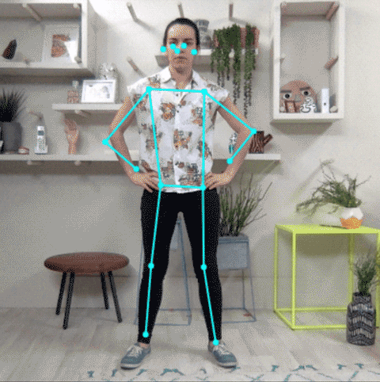
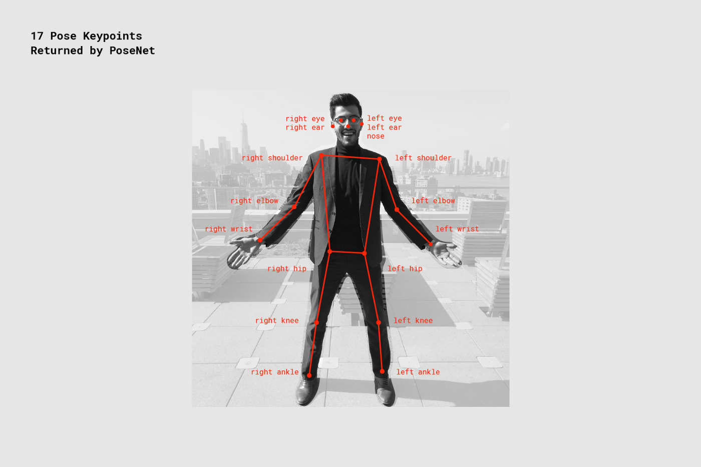
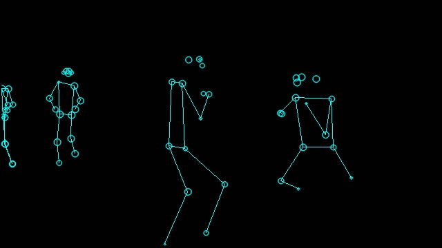

# Fight-Detection
This repository is made as a part of ACM month of code. This contains fight detection algorithms.

Fight detection is a part of action recognition tasks which is one of the hardest problems in the computer vision as it includes recognizing the activities from videos making a prediction from a series of frames, not just a single frame, so training an action recognition model is itself a challange.

In this project we have used two approaches to solve the problem
1) Using pretrained CNN to extract the features from video frames and then passing the extracted frames to rnn to get the prediction.
2) using POSENET

  <h1> USING CRNN:- </h1>
      CNNs are better at recognizing the basic and high level features of an image and Recurrent networks works well with time dependent data or sequential data, so we tried to leverage the power of both the networks to predict the fight in the video.
      <h3>The basic flowchart is as follows:</h3> 
      

            1) We have used pretrained cnn model to encode the predefined number of frames of a video and encoded it in a feature map, so basically CNN model is acting as an encoder network in the architecture. We have used Resnet152 architecture pretrained on imagenet dataset to as an encoder network to generate the feature vectors.  
            2) Training a RNN model on a feature vectors to get the prediction, the best choices for this are unidirectional/bidirectional LSTM or GRU units, as bidirectional LSTM/GRU are computationally expensive as compared to unidirectional LSTM/GRU and also we are not getting significant accuracy boost, so we have used unidirectional LSTM architecture with 2 hidden layer and two dense layer.here RNN model is acting as decoder which decodes the featuremap of different map to binary classes fight and non-fight.

                             
   <h1>General Architecture</h1>  

                                 

                                          
                                  

                                  
<h1> USING POSENET</h1>

    

PoseNet can be used to estimate either a single pose or multiple poses. The model overlays keypoints over the input image.

  

  

  PoseNet can be used to estimate either a single pose or multiple poses. The model overlays keypoints over the input image.
  

    

      
  

  

  Removing the background from this results in a much more simplified output that can be given to a CNN to get prediction:
   

      

      
  

  

Removing the background from this results in a much more simplified output that can be given to a CNN to get prediction:

 <h1>Set-Up </h1>
 <ul>
  <li>sign up on https://www.sms4india.com/.</li>
   <li>get API&Secret keys </li>
</ul>
